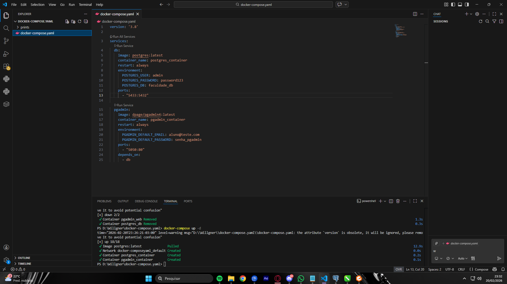
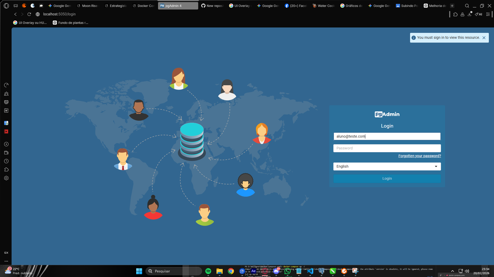
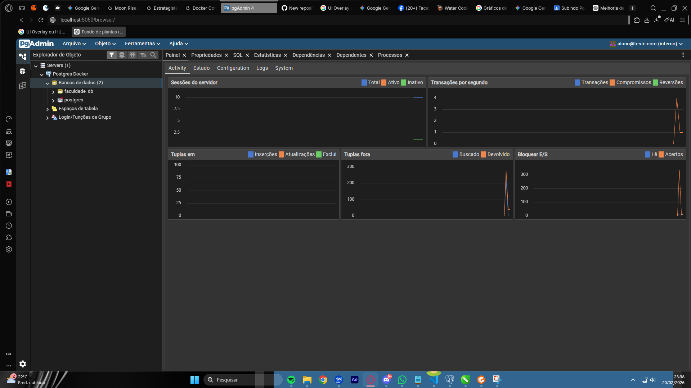

# Tarefa Docker: PostgreSQL + pgAdmin

Atividade de subir um ambiente de banco de dados usando Docker Compose.

## Comprovação de Funcionamento

### 1. Containers Rodando (VS Code)

### 2. Tela de Login do pgAdmin

### 3. Banco Conectado e Painel de Controle

